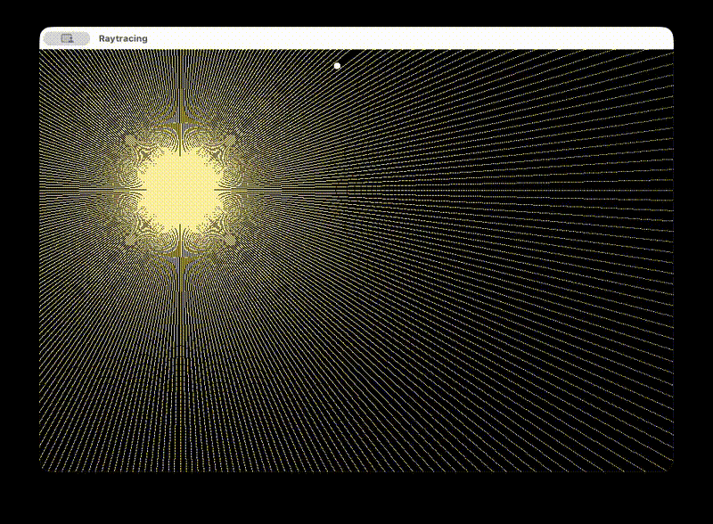

# Kepler
A simple Kepler problem simulation with a basic ray-tracing modeling.

---
## Introduction
The Kepler problem in Physics consist of determining the motion of particle moving under the newtonian gravitational attraction of a massive body. In this case, the massive body is also a source of light similar to the Sun-Earth system.

---
## Technicalities

The simulation is perfomed in the C programming language using the SDL2 library for graphics rendering.
The equations of motion are integrated using Euler's method.
---
## Possible Improvements
- Add numerical integrators with higher accuracy (e.g., Runge–Kutta methods).
- Draw the orbital trajectory (path tracing).
- Add the General Relativity correction to the Newtonian force.

---

## Demo

